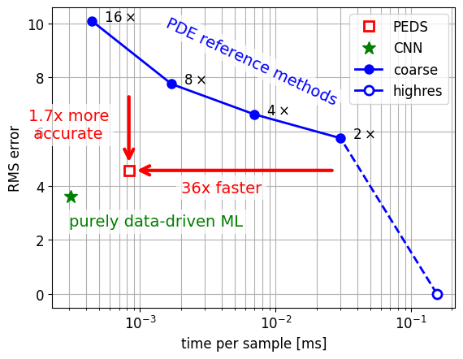

[](https://github.com/eikehmueller/PEDS/actions/workflows/automated-testing.yml)
# PEDS — Physics‑Enhanced Deep Surrogates

Python/PyTorch package for building **physics-enhanced neural surrogate (PEDS) models**, following the framework introduced in [Pestourie et al., *Nature Machine Intelligence* (2023)](https://www.nature.com/articles/s42256-023-00761-y). PEDS models learn PDE-approximations of physical systems while respecting known physical laws. This allows them to combine efficiency with domain-specific constraints while learning from data. At the moment, 1d and 2d diffusion models have been implemented in this repository.

## Goals

High-fidelity simulations in engineering and scientific domains are often computationally expensive. PEDS provide a framework to replace or augment these simulations with **efficient, physics-driven surrogate models**. By leveraging domain knowledge and neural networks, it allows making faster predictions, for example in uncertainty quantification, while maintaining physically meaningful behaviour.

One key challenge is back-propagation through the solver; here this is realised with the **adjoint-state method** based on highly efficient linear system solvers.

## Features

This repository contains code to

- Train and evaluate fast surrogate models that approximate expensive numerical solvers
- Integrate prior physical knowledge, such as conservation laws, into machine learning models to ensure physically consistent predictions  
- Provide a flexible, modular framework that can be extended to new models and domains (currently, 1d and 2d diffusion are implemented)
- Back-propagation through the solver during training is realised with the adjoint-state method
- Forward/backward solves are implemented efficiently in the [PETSc](https://petsc.org/) linear solver library

## Key achievements

Compared to a classical PDE-based reference method run at different resolutions, our PEDS implementation is **more than 30x faster** (for fixed accuracy) and **nearly twice as accurate** (for fixed runtime) when predicting the solution at a set of sample points for a 2d diffusion problem.

It doesn't quite reach the performance of a purely data-driven CNN model, but - in contrast to this approach - it also provides a coarse-grained solution field.



### Installation

To install this package clone the repository and run

```
pip install peds
```

If you want to edit the code, you might prefer to install in editable mode by passing the `--editable` flag.