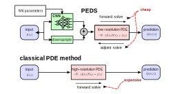

[](https://github.com/eikehmueller/PEDS/actions/workflows/automated-testing.yml)
# PEDS — Physics‑Enhanced Deep Surrogates

Python/PyTorch package for building **physics-enhanced neural surrogate (PEDS) models**, following the framework introduced in [Pestourie et al., *Nature Machine Intelligence* (2023)](https://www.nature.com/articles/s42256-023-00761-y). PEDS models learn PDE-approximations of physical systems while respecting known physical laws. This allows them to combine efficiency with domain-specific constraints while learning from data. At the moment, 1d and 2d diffusion models have been implemented in this repository.



## Goals

High-fidelity simulations in engineering and scientific domains are often computationally expensive. PEDS provide a framework to replace or augment these simulations with **efficient, physics-driven surrogate models**. By leveraging domain knowledge and neural networks, they allow making faster predictions, for example in uncertainty quantification, while maintaining physically meaningful behaviour.

One key challenge is back-propagation through the solver; here this is realised with the **adjoint-state method** based on highly efficient algorithm for the solution of large sparse linear systems.

## Features

This repository contains code to

- Train and evaluate fast surrogate models that approximate expensive numerical PDE solvers
- Integrate prior physical knowledge, such as conservation laws, into machine learning models to ensure physically consistent predictions  
- Provide a flexible, modular framework that can be extended to new models and domains (currently, 1d and 2d diffusion are implemented)
- Back-propagation through the solver during training is realised with the adjoint-state method
- Forward/backward solves are implemented efficiently in the state-of-the-art [PETSc](https://petsc.org/) linear solver library
- Provide routines for sampling from distributions of the input fields

## Achievements

Compared to a classical PDE-based reference method run at different resolutions, our PEDS implementation is **more than 30x faster** and **nearly twice as accurate** when predicting the solution at a set of sample points for a 2d diffusion problem.

It does not quite reach the performance of a purely data-driven CNN model, but - in contrast to this physics-agnostic approach - it also provides a coarse-grained solution field.


## Installation

To install this package clone the repository, install the prerequisites and run

```
pip install peds
```

If you want to edit the code, you might prefer to install in editable mode by passing the `--editable` flag.

Note that the code requires installation of the PETSc/petsc4py library, as described in the [PETSc installation instructions](https://petsc.org/release/install/) [petsc4py installation instructions](https://petsc.org/release/petsc4py/install.html).

#### Testing

Run the tests in the [tests/](tests/) sub-directory with

```
python -m pytest -v
```

## Usage

The setup is controlled with configuration files in [TOML format](https://toml.io/en/), see [src/config_1d.toml](src/config_1d.toml) and [src/config_2d.toml](src/config_2d.toml) for examples. This allows specification of

* model setup (1d/2d)
* filenames for trained models
* discretisation of the computational domain
* data distribution used for training
* training hyperparameters (batchsize, number of epochs, learning rate)

The configuration is parsed in [src/setup.py](src/setup.py).

The main scripts for training and evaluation can be found in the [src/](src/) folder; the subfolder [src/tools/](src/tools/) contains some additional scripts for visualisation and testing; these require the [Firedrake library](https://www.firedrakeproject.org/) but they are not essential for training and evaluation of the model.

### Training

To train the model for a configuration speficied in a configuration file run

```
python train.py CONFIG.toml
```

This will save the training model in the specified file. If the specified data file already exists, all training data will be read from this file. Otherwise the data will be generated and saved.

### Evaluation

The trained model can be evaluated with

```
python evaluate.py CONFIG.toml
```

This compares the performance of different setups

1. Classical PDE solvers run at different resolution
2. Purely data-drive ML approach based on a convolutional neural network
3. The PEDS model which combines ML and PDE based modelling

In addition, plots which quantify performance are generated.

The following snippet shows sample output generated for a trained model:

```bash
reading parameters from config_2d.toml

==== parameters ====

title = "PEDS configuration file"

[model]
dimension = 2          # dimension of problem
f_rhs = 1.0            # right hand side forcing term in W/mm^2
peds_filename = "../data/peds_model_2d_128x128_fibre.pth"
pure_nn_filename = "../data/pure_nn_model_2d_128x128_fibre.pth"

[discretisation]
n = 128             # number of grid cells
domain_size = 0.2   # linear extent of domain [mm]
scaling_factor = 16 # ratio between fine and coarse grid cells

[qoi]
sample_points = [[0.158,0.071],[0.149,0.175],[0.091,0.183],[0.059,0.058],[0.025,0.087],[0.044,0.170],[0.173,0.128],[0.041,0.019],[0.188,0.026],[0.106,0.084]]

# parameter for data generation
[data]
distribution = "fibre" # distribution ("lognormal" or "fibre")
n_samples_train = 2048 # number of training samples
n_samples_valid = 32   # number of validation samples
n_samples_test = 32    # number of test samples
filename = "../data/data_2d_128x128_fibre.npy"  # name of file with data

# parameters of log-normal distribution
[distribution.lognormal]
Lambda = 0.1           # correlation length for log-normal distribution

# parameters of fibre distribution
[distribution.fibre]
volume_fraction=0.55      # fibre volume fraction
r_fibre_avg=7.5E-3        # average fibre radius in mm
r_fibre_min=5.0E-3        # lower bound for fibre radius in mm
r_fibre_max=10.0E-3       # upper bound for fibre radius in mm
r_fibre_sigma=0.5E-3      # variance of fibre radius in mm
gaussian = true           # Gaussian distribution of fibre radii?
kdiff_background = 0.2E-3 # diffusion coefficient in background material in W/(mm*K)
kdiff_fibre = 7.0E-3      # diffusion coefficient in fibres in in W/(mm*K)

# parameters for training algorithm
[train]
train_peds = true   # train PEDS model?
train_pure_nn = true # train pure NN model?
batch_size = 64     # batch size
n_epoch = 128        # number of epochs
lr_initial = 1.0e-3 # initial learning rate
lr_final = 2.0e-4   # final learning rate

Running on device cpu
number of model parameters  = 1726 [PEDS], 10302 [pure NN]

==== error ====
  rmse error [peds      ] = 4.5618e+00
  rmse error [pure_nn   ] = 3.6000e+00
  rmse error [coarse  2x] = 5.7529e+00
  rmse error [coarse  4x] = 6.6351e+00
  rmse error [coarse  8x] = 7.7523e+00
  rmse error [coarse 16x] = 1.0083e+01

==== performance ====
  time per sample [peds      ] = 7.9413e-01 ms
  time per sample [pure_nn   ] = 3.3685e-01 ms
  time per sample [fine      ] = 1.3771e+02 ms
  time per sample [coarse  2x] = 3.0056e+01 ms
  time per sample [coarse  4x] = 6.9927e+00 ms
  time per sample [coarse  8x] = 1.6893e+00 ms
  time per sample [coarse 16x] = 4.2648e-01 ms
```