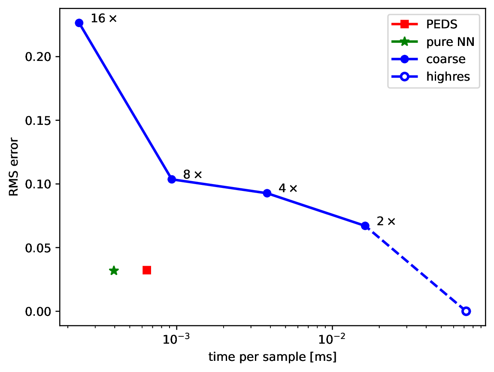

# PEDS — Physics‑Enhanced Deep Surrogates

Python/PyTorch package for building **physics-enhanced neural surrogate (PEDS) models**, following the framework introduced in [Pestourie et al., *Nature Machine Intelligence* (2023)](https://www.nature.com/articles/s42256-023-00761-y). PEDS models learn PDE-approximations of physical systems while respecting known physical laws. This allows them to combine efficiency with domain-specific constraints while learning from data. At the moment, 1d and 2d diffusion models have been implemented in this repository.

## Goals

High-fidelity simulations in engineering and scientific domains are often computationally expensive. PEDS provide a framework to replace or augment these simulations with **efficient, physics-driven surrogate models**. By leveraging domain knowledge and neural networks, it allows making faster predictions, for example in uncertainty quantification, while maintaining physically meaningful behaviour.

## Features

This repository contains code to

- Train and evaluate fast surrogate models that approximate expensive numerical solvers  
- Integrate prior physical knowledge, such as conservation laws, into machine learning models to ensure physically consistent predictions  
- Provide a flexible, modular framework that can be extended to new models and domains (currently, 1d and 2d diffusion are implemented)

### Installation
To install this package clone the repository and run

```
pip install peds
```

If you want to edit the code, you might prefer to install in editable mode by passing the `--editable` flag.

## Results

The following figure shows the performance/accuracy tradeoff for classical models with different solution, the PEDS method and a pure neural network approach:

